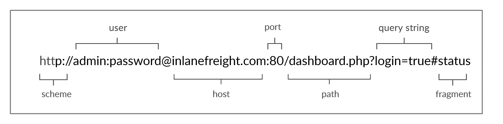
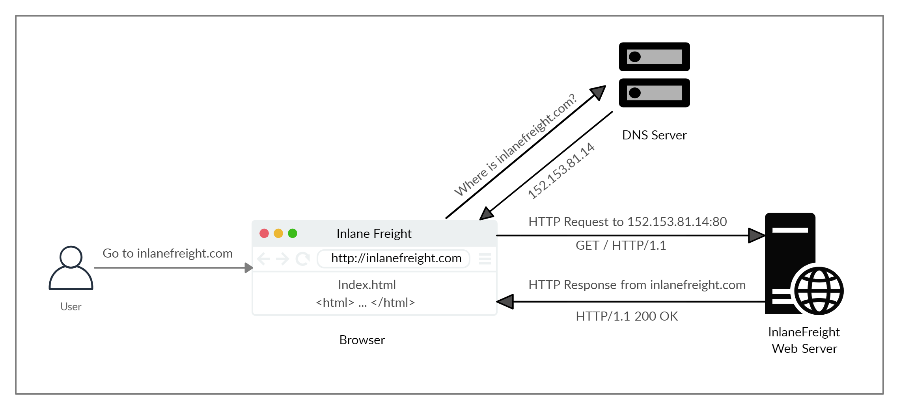

# WEB-REQUESTS #

## HTTP FUNDAMETALS ##

  ### HTTP ###
  - HyperText Transfer Protocol
  - Application-level Protocol
  - Use to access the WWW
  - Communication consists of a client and a server, where the client requests the server for a resource. The server processes the requests and returns the requested resource.
  - Default port for HTTP communication is port 80
    
 ### URL ###
 - Resources over HTTP are accessed via a URL
   
   
### HTTP Flow ###
  
- The first time a user enters the URL (inlanefreight.com) into the browser, it sends a request to a DNS (Domain Name Resolution) server to resolve the domain and get its IP. The DNS server looks up the IP address for inlanefreight.com and returns it. All domain names need to be resolved this way, as a server can't communicate without an IP address.
  #### NOTE ####
  - Our browsers usually first look up records in the local '/etc/hosts' file, and if the requested domain does not exist within it, then they would contact other DNS servers. We can use the '/etc/hosts' to manually add records to for DNS resolution, by adding the IP followed by the domain name.
- Once the browser gets the IP address linked to the requested domain, it sends a GET request to the default HTTP port (e.g. 80), asking for the root / path. Then, the web server receives the request and processes it. By default, servers are configured to return an index file when a request for / is received.
- In this case, the contents of index.html are read and returned by the web server as an HTTP response. The response also contains the status code (e.g. 200 OK), which indicates that the request was successfully processed. The web browser then renders the index.html contents and presents it to the user. 

### cURL ###
- A command-line tool
- Library that primarily supports HTTP along with many other protocols
- Good candidate for scripts as well as automation

### HTTPS ###
- Drawbacks of HTTP is
- that all data is transferred in clear-text
- That means Man-in-the-middle (MiTM) attack can be perform
- To counter this issue, the HTTPS (HTTP Secure) protocol was created
- In which all communications are transferred in an encrypted format
  #### NOTE ####
  - Although the data transferred through the HTTPS protocol may be encrypted, the request may still reveal the visited URL if it contacted a clear-text DNS server. For this reason, it is recommended to utilize encrypted DNS servers (e.g. 8.8.8.8 or 1.2.3.4), or utilize a VPN service to ensure all traffic is properly encrypted.

### HTTPS Flow ###

- If we type http:// instead of https://
- To visit a website that enforces HTTPS
- The browser attempts to resolve the domain and redirects the user to the webserver hosting the target website
- A request is sent to port 80 first, which is the unencrypted HTTP protocol. The server detects this and redirects the client to secure HTTPS port 443 instead. This is done via the 301 Moved Permanently response code

- Next, the client (web browser) sends a "client hello" packet, giving information about itself.
- After this, the server replies with "server hello", followed by a key exchange to exchange SSL certificates.
- The client verifies the key/certificate and sends one of its own.
- After this, an encrypted handshake is initiated to confirm whether the encryption and transfer are working correctly.
  #### NOTE ####
  - Depending on the circumstances, an attacker may be able to perform an HTTP downgrade attack, which downgrades HTTPS communication to HTTP, making the data transferred in clear-text. This is done by setting up a Man-In-The-Middle (MITM) proxy to transfer all traffic through the attacker's host without the user's knowledge. However, most modern browsers, servers, and web applications protect against this attack.

### cURL for HTTPS ###
- cURL should automatically handle all HTTPS communication standards and perform a secure handshake and then encrypt and decrypt data automatically.
- However, if we ever contact a website with an invalid SSL certificate or an outdated one, then cURL by default would not proceed with the communication to protect against the earlier mentioned MITM attacks
- To skip the certificate check with cURL, we can use the -k flag

### HTTP REQ ###
 
 
- The first line of any HTTP request contains three main fields 'separated by spaces':
